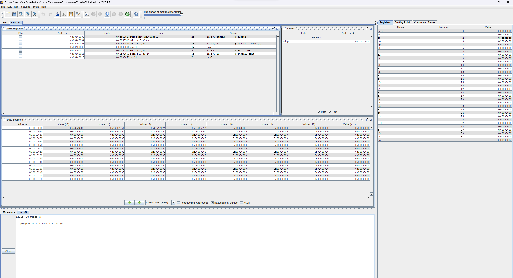

# HW 1 (2024.09.2)   
   
- Для отчета была выбрана программа hello01.s   
   
```
.text
        la a0, string       # buffer
        li a7, 4            # syscall write (4)
        ecall
        li a0, 0            # exit code
        li a7, 10           # syscall exit
        ecall
.data
    string:  .asciz "Hello! It works!!!\n"
```
демонстрация работы RARS   
      
   
- Псевдокоманды   
    Псевдокомандами (Extended (pseudo) instructions) это набор команд, которые не являются напрямую машинными инструкциями, а предствляют небольшую надстройку над ними, что позволяет программисту проще и понятней читать код. В моей программе с помощью RARS я выявил эти псевдокоманды:
   
    ```
la a0, string #Load Address : загрузка в регистр a0 адресс string
li a7, 4 #Load Immediate : незамедлительное изменение регистра на требуемое число.
li a0, 0 #Load Immediate : незамедлительное изменение регистра на требуемое число.
li a7, 10 #Load Immediate : незамедлительное изменение регистра на требуемое число.    
```
- Форматы команд   
    В данной программе используются следующие форматы:   
    ```
.text #не является исполняемой инструкцией и не может относится к какому-либо формату
        la a0, string       # I-формат
        li a7, 4            # I-формат
        ecall               # специальная инструкция, не имеет формата
        li a0, 0            # I-формат
        li a7, 10           # I-формат
        ecall               # специальная инструкция, не имеет формата
.data #не является исполняемой инструкцией и не может относится к какому-либо формату
    string:  .asciz "Hello! It works!!!\n" #не является исполняемой инструкцией и не может относится к какому-либо формату
```
- Системные вызовы   
    В данной программе используются следующие системные вызовы:   
    ```
li a7, 4 #4 код системного вызова для вывода числа
li a7, 10 #10 код системного вызова для завершения программы
----------------------------------------------------------------------------------
li a0, 0 #не является системным вызовом т.к кода 0 нет

```
   
   
Видео находится в этой же папке и называется 2024-09-08-10-48-06.mp4
