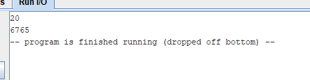

# HW2   
```
main:
    mv t0, zero       # псевдокоманда (R-type) - `mv` преобразуется в `addi t0, zero, 0`
    li t1, 1          # псевдокоманда (I-type) - `li` преобразуется в `addi t1, zero, 1`
    
    li a7, 5          # псевдокоманда (I-type) - `li` преобразуется в `addi a7, zero, 5`
    ecall             # команда (ecall используется для системного вызова)
    mv t3, a0         # псевдокоманда (R-type) - `mv` преобразуется в `addi t3, a0, 0`
fib:
    beqz t3, finish  # команда (I-type) - `beqz` используется для условного перехода, если `t3` равно нулю
    add t2, t1, t0   # команда (R-type) - `add` выполняет сложение
    mv t0, t1         # псевдокоманда (R-type) - `mv` преобразуется в `addi t0, t1, 0`
    mv t1, t2         # псевдокоманда (R-type) - `mv` преобразуется в `addi t1, t2, 0`
    addi t3, t3, -1   # команда (I-type) - `addi` выполняет сложение с немедленным значением
    j fib             # команда (J-type) - `j` выполняет безусловный переход
finish:
    li a7, 1          # псевдокоманда (I-type) - `li` преобразуется в `addi a7, zero, 1`
    mv a0, t0         # псевдокоманда (R-type) - `mv` преобразуется в `addi a0, t0, 0`
    ecall             # команда (ecall используется для системного вызова)

```
    
В данной программе мы просто проваливаемся в конце, т.к не передаем код завершения.   
|      Адрес |        Код |               Базовая команда |                Исходная команда |                     формат базовой команды |                      Формат исходной команды |
|:-----------|:-----------|:------------------------------|:--------------------------------|:-------------------------------------------|:---------------------------------------------|
| 0x00400000 | 0x00100313 |                  add x5,x0,x0 |                     mv t0, zero |                                     R-type |                                       I-type |
| 0x00400004 | 0x00100313 |                  addi x6,x0,1 |                        li t1, 1 |                                     I-type |                                       I-type |
| 0x00400008 | 0x00500893 |                 addi x17,x0,5 |                        li a7, 5 |                                     I-type |                                       I-type |
| 0x0040000c | 0x00000073 |                         ecall |                           ecall |                                            |                                              |
| 0x00400010 | 0x00a00e33 |                add x28,x0,x10 |                       mv t3, a0 |                                     R-type |                                       I-type |
| 0x00400014 | 0x000e0c63 |         beq x28,x0,0x00000018 |                 beqz t3, finish |                                     I-type |                                       I-type |
| 0x00400018 | 0x005303b3 |                  add x7,x6,x5 |                  add t2, t1, t0 |                                     R-type |                                       R-type |
| 0x0040001c | 0x006002b3 |                  add x5,x0,x6 |                       mv t0, t1 |                                     R-type |                                       I-type |
| 0x00400020 | 0x00700333 |                  add x6,x0,x7 |                       mv t1, t2 |                                     R-type |                                       I-type |
| 0x00400024 | 0xfffe0e13 |       addi x28,x28,0xffffffff |                       mv t1, t2 |                                     I-type |                                       I-type |
| 0x00400028 | 0xfedff06f |             jal x0,0xffffffec |                           j fib |                                     J-type |                                       J-type |
| 0x0040002c | 0x00100893 |                 addi x17,x0,1 |                        li a7, 1 |                                     I-type |                                       I-type |
| 0x00400030 | 0x00500533 |                 add x10,x0,x5 |                       mv a0, t0 |                                     R-type |                                       I-type |
| 0x00400034 | 0x00000073 |                         ecall |                           ecall |                                            |                                              |

   
